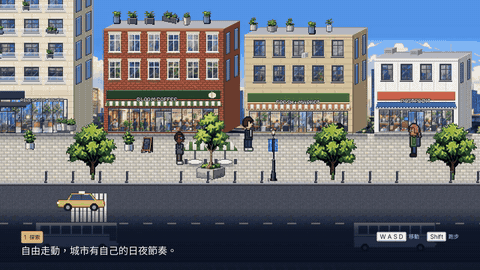

# CITY VENTURE

A modern pixel-art business-life RPG. Build · Live · Connect · Grow.

- **Product baseline:** [`docs/reference/CITY_VENTURE_MASTER_HANDOFF_FOR_CLAUDE_CODE.md`](docs/reference/CITY_VENTURE_MASTER_HANDOFF_FOR_CLAUDE_CODE.md)
- **Spec readback:** [`docs/CITY_VENTURE_SPEC_READBACK.md`](docs/CITY_VENTURE_SPEC_READBACK.md)
- **Audit:** [`docs/CURRENT_PROJECT_AUDIT.md`](docs/CURRENT_PROJECT_AUDIT.md)
- **Architecture:** [`docs/ARCHITECTURE.md`](docs/ARCHITECTURE.md) · **Roadmap:** [`docs/ROADMAP.md`](docs/ROADMAP.md)
- **Engine decision & store path:** [`docs/ENGINE_DECISION.md`](docs/ENGINE_DECISION.md) · **QA:** [`docs/QA_REPORT.md`](docs/QA_REPORT.md)
- **Data schema:** [`docs/GAME_DATA_SCHEMA.md`](docs/GAME_DATA_SCHEMA.md) · **Art manifest:** [`docs/ART_ASSET_MANIFEST.md`](docs/ART_ASSET_MANIFEST.md) · **Story:** [`docs/STORY_IMPLEMENTATION.md`](docs/STORY_IMPLEMENTATION.md)

Engine: Godot 4.5.x (project in `game/`).

## Trailer (≈30 s, doubles as a first-play tutorial)



- 繁體中文: [`docs/media/trailer_zh.mp4`](docs/media/trailer_zh.mp4) · English: [`docs/media/trailer_en.mp4`](docs/media/trailer_en.mp4)
- The trailer is real gameplay recorded by the trailer bot (`game/tests/walkthrough/trailer.gd`) with Godot Movie
  Maker, then encoded by `tools/media/make_trailer.sh`. The music is code-generated (`tools/media/make_music.py`) and is a
  placeholder until a licensed track is chosen.

## What's new in 0.1.2-test2 (playtest round 1)

- **New-player tutorial:** step cards, a gold arrow to the current goal, glowing EXIT mats and street-edge signs,
  "Enter X" chips at doors, and clickable Phone/Map/Menu buttons and prompts.
- **Continuous autosave:** on every scene change, every 15 s, and when the window or tab closes. The web build keeps
  progress across a refresh.
- **More careers:** 5 part-time jobs with promotions and perks, plus freelance consulting gigs with invoices, payment
  terms and reputation.
- **Garbled-text fixes:** NPC names shown as months, illegible name tags, the café menu board, and glyphs that were
  missing on the web.
- Art swap contract for the visuals track: [`docs/ART_HANDOFF.md`](docs/ART_HANDOFF.md).

## Run

```bash
godot --path game                       # play (1280×720 window, 640×360 pixel canvas)
```

Languages: English · 繁體中文 · 简体中文. Switch them on the main menu or in the pause menu (Esc), or start with
`godot --path game -- --lang=zh_TW`. Translations are in `tools/i18n/zh_TW.json`; run `python3 tools/i18n_extract.py --check`.

Controls: WASD/arrows walk (Shift run) · E/Space interact (or click the prompt) · Tab phone · M city map · hold T fast-forward · Esc pause/close.

## Build, test, evidence

```bash
pip install -r tools/requirements.txt   # numpy, pillow, opencv (art conversion)
tools/build.sh                          # art → district layout → import → unit tests → Windows + Linux export
godot --headless --path game res://tests/test_runner.tscn                  # unit tests
godot --headless --path game -- --bot=walkthrough --out=/tmp/wt            # full slice played by real input
```

- Tester packages: `tools/package_release.sh` builds `dist/CityVenture-<version>-{Windows,macOS,Linux,Web}.zip`.
  Each zip includes a bilingual tester guide, and the web zip can be uploaded to itch.io as an HTML game.
  Testers press **F12** (web: Esc → Report a problem) to save a screenshot, save file and log for a bug report.
- QA report: [`docs/QA_REPORT.md`](docs/QA_REPORT.md) · evidence: [`evidence/vs001/`](evidence/vs001/)
- Art is generated/converted by code in `tools/art/` (`concepts.py` converts the approved concept boards in
  `docs/reference/concept_boards/` into game-ready sprites; see the art manifest for what is converted vs generated).
