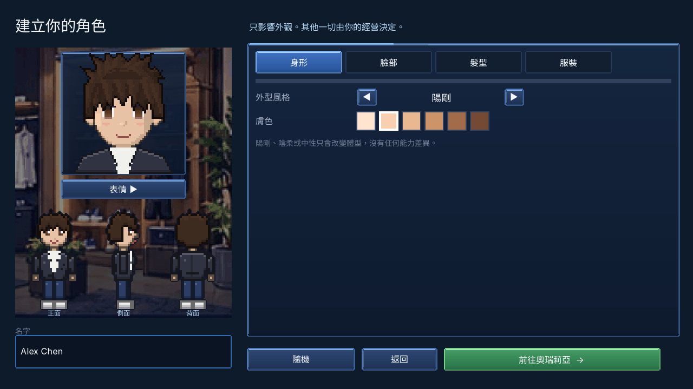

# A1 角色走路圖交件（2026-09-28）

## 範圍與做法

- 依 `docs/wiki/90_codex_art_backlog.md` 的 A1 清單，檢查並重新產生 `game/assets/characters/` 的 128 張 128×144 圖層。122 張像素內容改變；6 張透明或既有髮層維持原樣。
- 重畫肩腰比例、圓角鞋與髮型輪廓；快遞腰包、市政名牌、寬版西裝領口在 1× 更易辨認。
- 四格步伐依序為接地、右腳跨步、交錯、左腳跨步；側面前後腿與手臂換位，不再重複同一個跨步姿勢。
- 移除每個透明圖層內的獨立硬外框，保留遊戲既有的**合成角色外框 shader**，使衣服、皮膚和頭髮相接處不再形成黑色方塊。使用原有灰階染色、檔名、圖層順序與 32×48 影格。
- 來源為 `tools/art/chars.py`；使用 `tools/art/preview_a1.py` 組合檢查。未改遊戲腳本、資料或玩法。

## 改前與改後

| 遊戲捏臉畫面 | 圖層預覽 |
|---|---|
| [改前](before_creator.png) · [改後](after_creator.png) | [改前](before_preview_chars.png) · [改後](after_preview_chars.png) |

改後詳細驗收圖：[8 種髮型](after_hair_styles.png)、[3 種體型](after_body_types.png)、[9 套服裝](after_outfits.png)、[12 位具名 NPC](after_named_npcs.png)、[正面四格](after_walk_front.png)、[側面四格](after_walk_side.png)、[背面四格](after_walk_back.png)、[抵達場景](after_arrival.png)。

## 驗證

- 128 張 PNG 均為 128×144，透明度僅 0 或 255，保留可染色灰階層。
- Godot 4.5.1 `--headless --path game --import`：成功。
- Godot 4.5.1 `res://tests/test_runner.tscn`：**58/58 tests passed**。
- Godot 4.5.1 `--bot=shots`：**28 張截圖、0 failure(s)**。
- `python tools/wiki_check.py`：`wiki_check: OK (506 assets, 156 data ids)`。
- 所有角色圖層的正、側、背三方向和四格步伐已使用組合圖檢查。

## 尚待後續批次

- 遊戲仍以 640×360 畫布和 nearest-neighbor 顯示 32×48 角色，因此放大後仍會看到像素邊緣。本批使**角色本身**的輪廓與內部接縫較圓滑；室內、街景、地磚和 UI 的整體風格需在 A2–A7 逐批處理。
- 頭像不在 A1；目前捏臉畫面的大頭圖仍是舊版，屬 A5。
- Maya 與 Elena 現在可由藍色休閒外套和白襯衫識別。若要再拉開髮型與五官，需由 Claude 線改 `game/data/npcs/elena.json`，對應 backlog 程式接線 #18。
