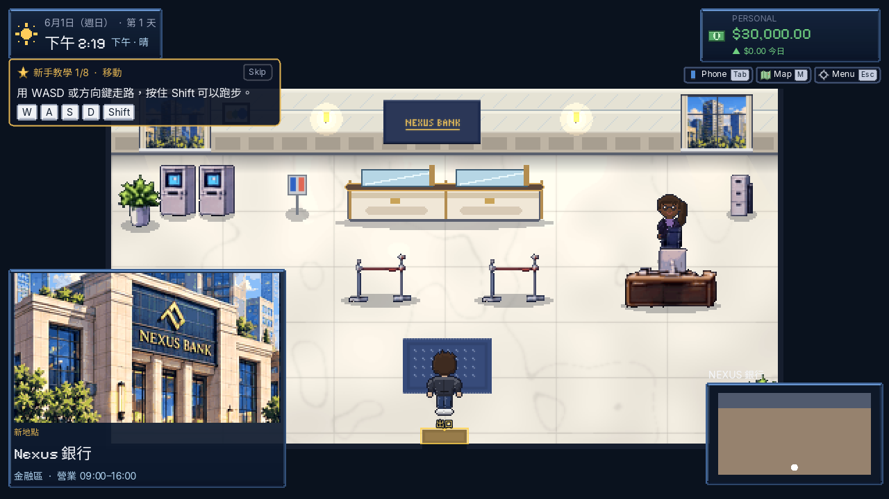
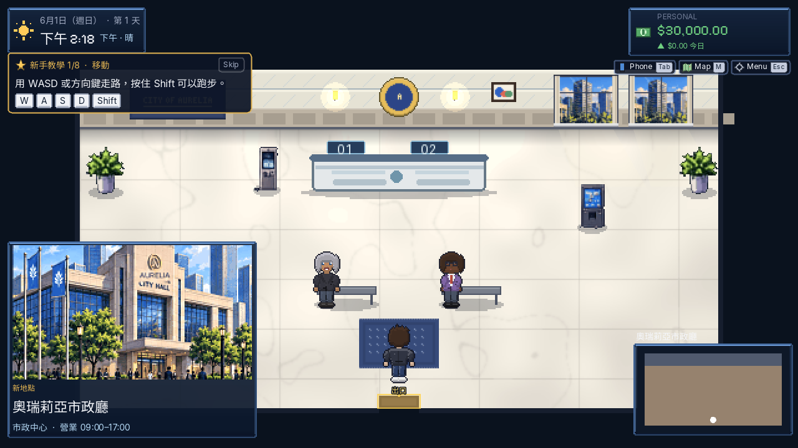

# A2 室內家具、地板與牆面（2026-09-28）

## 改動

- 68 張既有室內物件維持原尺寸，統一做表面色階與明暗柔化；`bank_counter`、`civic_counter`、`menu_board`、`desk_laptop`、`packing_table`、`wardrobe`、`box` 七項依功能重畫。
- 銀行櫃台使用木色、金邊與玻璃隔板；市政櫃台改為淺色石材和號碼燈。菜單板以咖啡杯圖示和色塊取代文字。
- 五張既有地板保留原細密紋理並柔化色彩；新增 `floor_tile_white.png`、`floor_checker.png`、`floor_carpet_navy.png`，均為 512×320。七款牆磚更新在 atlas 原座標。沒有修改家具擺位、碰撞或 sprite metadata。
- 產生器 `tools/art/a2_interiors.py` 從**未修改的輸入資產**產出到獨立資料夾，再拷貝 A2 檔案；不執行會覆蓋全遊戲素材的 placeholder 腳本。

## 實機對照

| 場景 | 改前 | 改後 |
|---|---|---|
| Bloom Coffee | [圖](before_18_interior_bloom_coffee.png) | [圖](after_18_interior_bloom_coffee.png) |
| Bean & Byte | [圖](before_19_interior_byte_and_bean.png) | [圖](after_19_interior_byte_and_bean.png) |
| City Hall | [圖](before_20_interior_city_hall.png) | [圖](after_20_interior_city_hall.png) |
| Nexus Bank | [圖](before_21_interior_nexus_bank.png) | [圖](after_21_interior_nexus_bank.png) |
| Nexus Co-work | [圖](before_22_interior_nexus_cowork.png) | [圖](after_22_interior_nexus_cowork.png) |
| PostPoint | [圖](before_23_interior_postpoint_riverside.png) | [圖](after_23_interior_postpoint_riverside.png) |
| Riverside Apartment | [圖](before_24_interior_riverside_apartment.png) | [圖](after_24_interior_riverside_apartment.png) |
| Suite 2B | [圖](before_25_interior_small_office.png) | [圖](after_25_interior_small_office.png) |

窗戶圖層：[改前白天](before_window_day.png)／[改後白天](after_window_day.png)、[改前夜晚](before_window_night.png)／[改後夜晚](after_window_night.png)。

## 驗證與界線

- Godot 4.5.1 匯入成功；單元測試 **64/64 passed**；實機 28 張截圖巡禮 **0 failure(s)**。
- `wiki_check: OK (517 assets, 156 data ids)`；76 張室內 PNG 含 68 物件與 8 地板。三張新 PNG 已連同 `.png.import` 提交。
- 68 張既有物件尺寸維持不變；七款牆磚沿用既有 atlas 座標，因此沒有碰撞及資料改動。
- 640×360 畫布仍以 nearest 顯示；本批只改善室內物件和色階，街景與 UI 的整體像素感仍屬後續 A3–A7。
