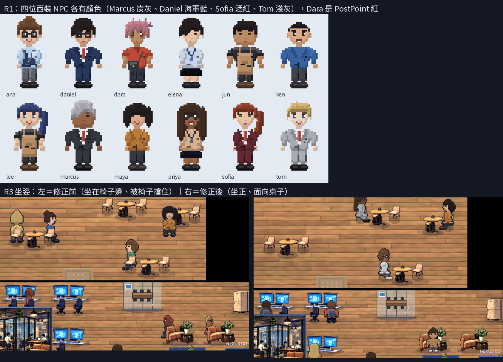
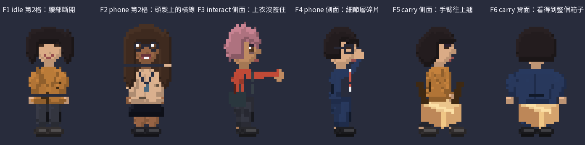

# R1、A2、R3 驗收（Claude 線，2026-09-28）

Codex 的三批（PR #3 R1、#4 A2、#5 R3）已合併到 `claude/exciting-bardeen-y71ixv`，並補上遊戲程式端的配合。

## 結果

| 批次 | 結論 | 遊戲端做了什麼 |
|------|------|---------------|
| R1 服裝拆層 | ✅ 通過 | Marcus、Daniel、Sofia、Tom 的西裝顏色，以及 Dara 的快遞服寫入 NPC 資料。路人的西裝改用西裝色，上下身同色 |
| A2 室內 | ✅ 通過 | 不需要改動 |
| R3 姿勢 | ⚠️ `sit` 通過，其他姿勢待修 | 座位對齊到椅子中間、面向桌子；`idle`、`phone` 暫時只播第 1 格；出貨員工暫時用 `idle` |

## R3 待修的瑕疵

用 `python3 tools/qa/pose_check.py` 檢查，工具會用和遊戲相同的方式疊圖。修正清單見 [`docs/wiki/90_codex_art_backlog.md` 的 R3 修正](../../docs/wiki/90_codex_art_backlog.md#r3-修正--優先)。

## 驗證

| 項目 | 結果 |
|------|------|
| 單元測試 | 67/67 |
| `--bot=shots` | 28 張，0 失敗 |
| 完整遊玩（第 1–6 章） | 0 失敗 |
| `tools/wiki_check.py` | OK（1187 個素材、156 個資料 id） |
| `tools/i18n_extract.py --check` | 缺 0 |
