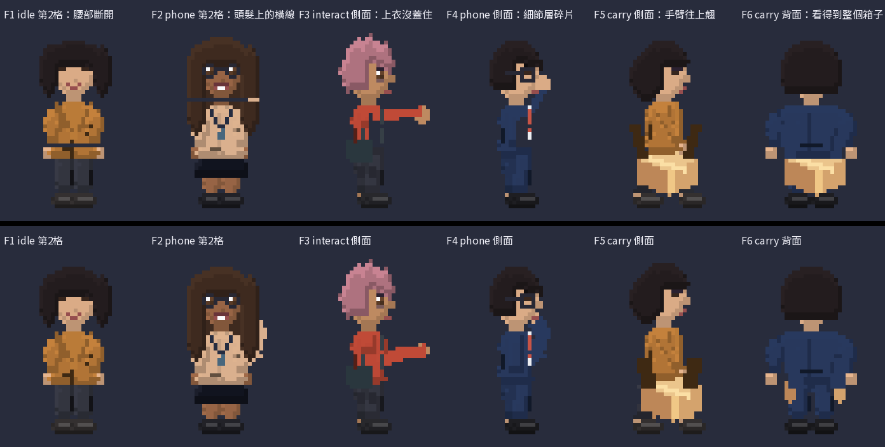
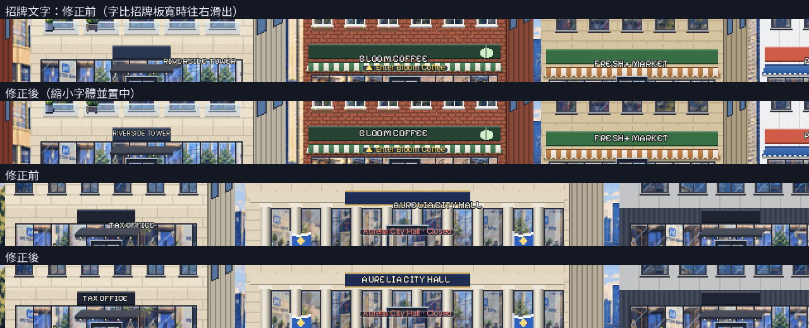
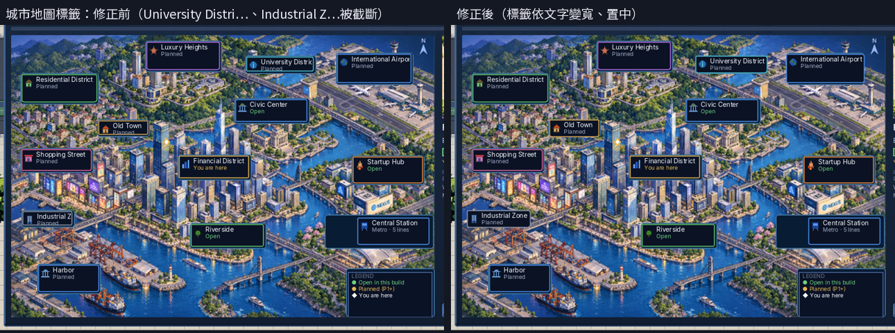

# 第三輪美術驗收（R3 修正、A3、A4、A6、A5）

Codex 的五批（PR #6–#10）已合併到 `claude/exciting-bardeen-y71ixv`。以下是 Claude 線的驗收結果和遊戲端的配合修正。

## 驗收結果

| 批次 | 結論 |
|------|------|
| R3 修正 | ✅ 六個瑕疵全部修好，`pose_check: OK`。`idle`、`phone` 恢復 2 格動畫，出貨員工恢復 `interact` |
| A3 建築 | ✅ 門和側牆更立體，夜燈自然 |
| A4 街道 | ✅ 人行道、柏油、河面不再有格子感 |
| A6 地圖、地點卡 | ✅ R2 完成。地點卡有幾處去字補丁太平，列在 R7 |
| A5 頭像 | ✅ 眼鏡到位，表情更清楚 |

## 遊戲端修正

1. **招牌文字置中**：名字比招牌板寬時，文字會往右滑出招牌板。現在會縮小字體，並置中在招牌板上。

   

2. **地圖標籤自動寬度**：標籤卡原本固定寬度，長名字會被截斷。現在依文字長度變寬，保持置中，並留在地圖範圍內。

   

3. **Priya 的襯衫**：蜜桃色太接近膚色，改成青綠色 `#3F9E96`。

## 新工具

`tools/qa/map_label_check.py` 比對地圖底圖上的空白補丁和遊戲標籤的位置。目前回報兩處待 Codex 修正，見 `docs/wiki/90_codex_art_backlog.md` 的 R7。

## 驗證

| 項目 | 結果 |
|------|------|
| `pose_check` | OK |
| 單元測試 | 67/67 |
| 截圖巡禮 | 28 張，0 失敗 |
| 完整遊玩第 1–6 章 | 0 失敗 |
| `wiki_check` | OK |
| 翻譯 | 缺 0 |
