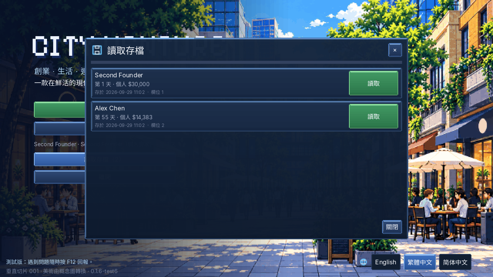
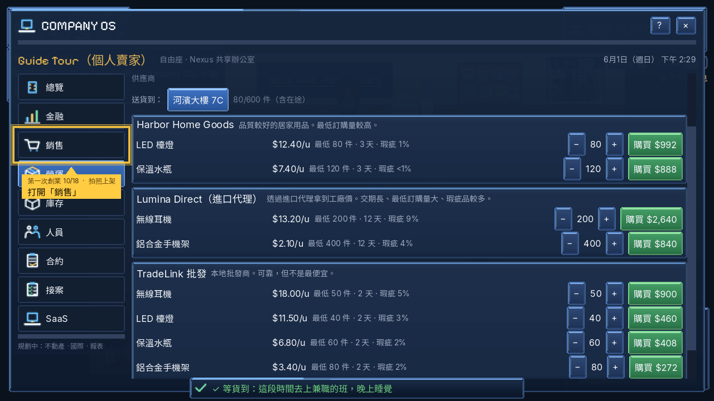
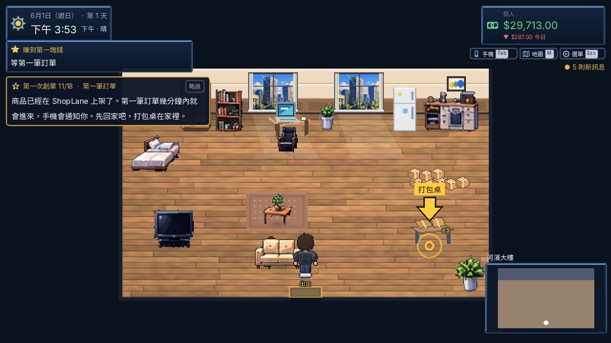
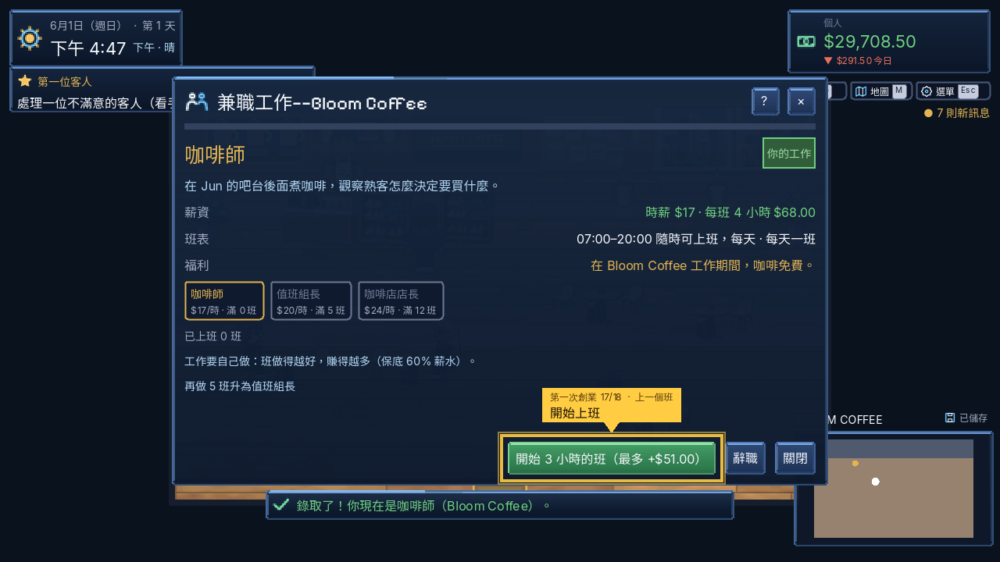
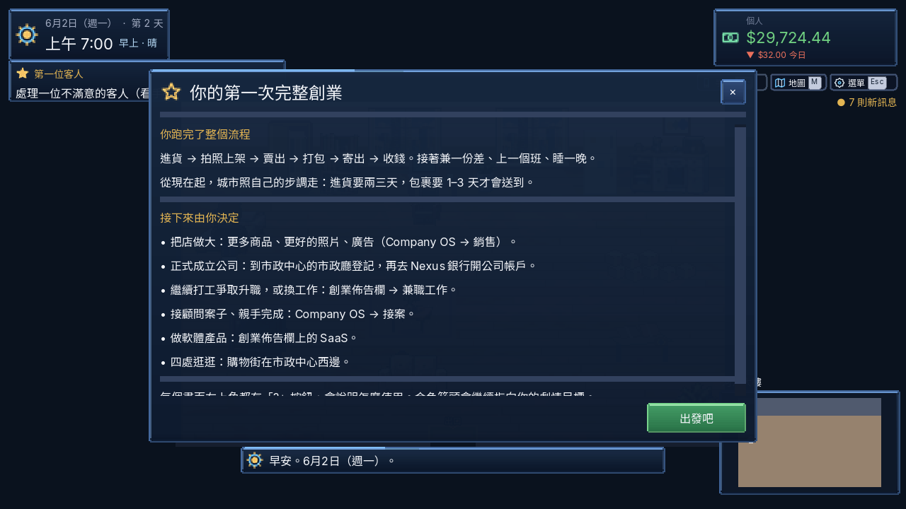
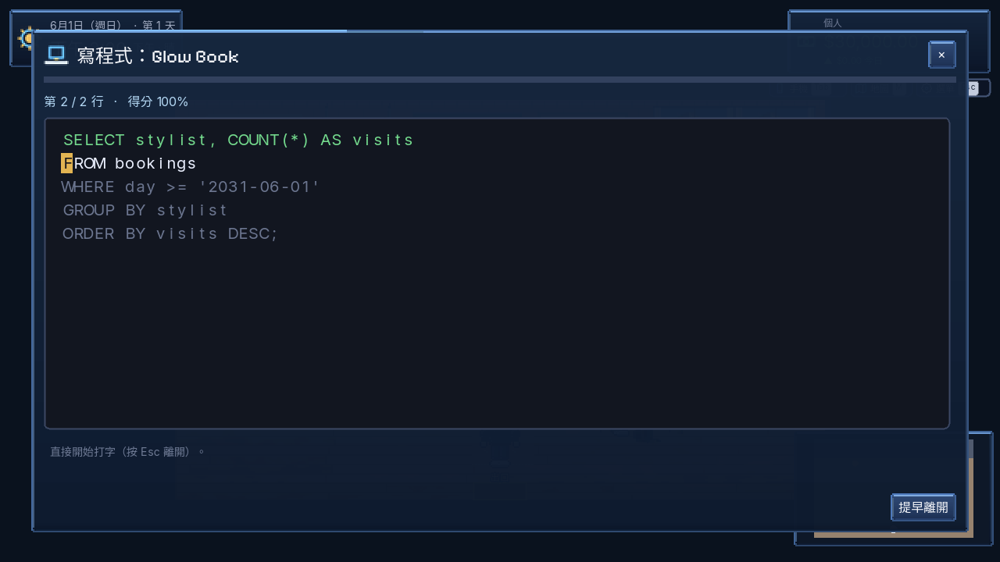
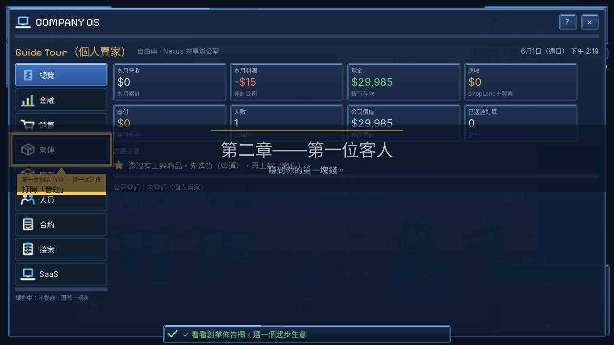
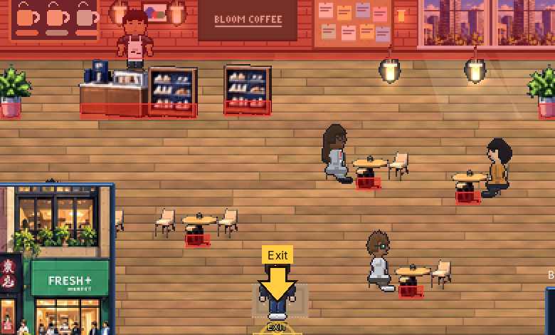
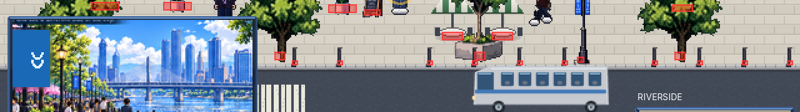
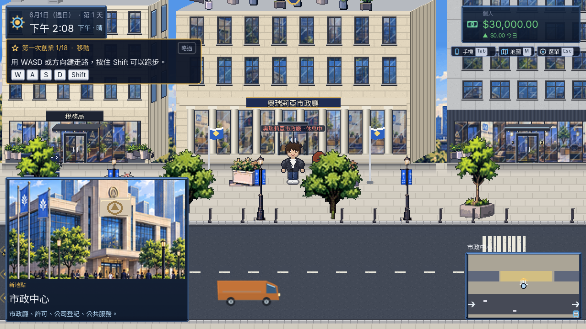

# 第二次試玩回饋（0.1.6-test6）

2026-09-29 第二次試玩提出的問題：

1. 中文版裡還有英文。
2. 打字小遊戲太長，像在上班。
3. 數字 5 顯示怪怪的。
4. 新手教學等貨太久，不知道要幹嘛。
5. 走路碰撞不順。
6. 不小心按到新遊戲，存檔就回不去了。
7. 重開時教學要我收訊息，但收不到。

規則寫在 [`docs/wiki/13_core_loop_and_work.md`](../../docs/wiki/13_core_loop_and_work.md)，這裡放截圖和驗證結果。截圖都是中文介面。

## 1. 存檔不會再不見

每場遊戲有自己的欄位，自動存檔寫在自己的欄位。

- 「新遊戲」會用空欄位，不會蓋掉正在玩的那場。
- 標題畫面多了「讀取存檔」。
- 欄位都滿時會先問要取代哪個。被取代的檔案移到 `saves/replaced/`，不會刪掉。

| 標題畫面 | 讀取存檔 |
|---|---|
|  |  |

## 2. Maya 的訊息

訊息原本存的是英文原文，所以中文版的通知和訊息列表都顯示英文。現在存入和顯示時都會翻譯。

教學走到「看手機」時，如果手機裡沒有未讀的 Maya 訊息，她會再傳一則新的。沒有未讀的情況包括重開前已經讀過，或對話講到一半就關掉。

## 3. 新手教學不用等

教學期間：

- 第一次進貨當場送到；
- 上架後 8–15 遊戲分鐘就有第一筆訂單；
- 快遞 10 分鐘來收件；
- 第一個包裹 20 分鐘送達。

順序改成：進貨 → 拍照上架 → 第一筆訂單 → 打包 → 寄出 → 收錢 → 兼差 → 上班 → 睡覺。

自動測試下午 2 點開始，4 點 39 分收到第一筆錢，當晚睡覺後畢業。

| 買完貨直接去「銷售」拍照上架 | 回家等第一筆訂單 |
|---|---|
|  |  |

來晚了也能上班：下午 4 點 47 分開一個 3 小時的班，上到 8 點打烊，按時數給薪。提示泡泡放在按鈕上方，不會被通知擋住。

| 3 小時的班 | 第一天晚上畢業 |
|---|---|
|  |  |

## 4. 打字小遊戲變短

整段程式都在畫面上，只要打亮色的一兩行，最多 2 行、64 字。灰色的已經寫好。

## 5. 數字 5

像素標題字型的 5 和 S 一模一樣，「$29,985」會看成「$29,98S」。現在含數字的標題（金額、時間、分數）改用粗體 Inter。

## 6. 走路碰撞

- 玩家腳底改成圓角膠囊，移動模式改成俯視角用的 floating。
- 直直走向門口但偏了幾格時，會自動往空的那側滑。
- 家具、樹、路樁只擋底部實際畫出來的部分。

下面紅框是碰撞範圍：桌子只擋桌腳，樹只擋樹幹，路樁只擋樁身。

## 7. 中文版裡的英文

bot 在中文模式下，每 0.5 秒掃一次畫面上所有文字，列出含英文單字的。檢查的是實際畫出來的字，不是原文；教學自己畫的箭頭標籤和提示泡泡也算在內。人名、品牌和譯文裡本來就保留的英文不算。

找到並修好的：

- 訊息通知與訊息列表；
- 教學箭頭標籤（「Reception」→「櫃檯」）；
- 街上招牌：一般名稱翻譯，品牌保留；
- 資訊卡標題、聯絡人職稱、服飾店「已擁有」；
- 財務頁費用類別、撥款訊息的帳戶類型、退貨結果；
- 合約紀錄、兼職雇主名稱、「led 檯燈」被轉成小寫。

最後一輪掃描剩下的，都是應該保留原樣的：

- 人名：Kai Clarke、Tess Park；
- 編號：PO-101、AUR-992716；
- 產品與品牌名：Glow Book、SHOPLANE；
- 語言按鈕「English」。

## 狀態

| 項目 | 狀態 |
|------|------|
| 存檔欄位、讀取存檔、取代前確認與備份 | Implemented |
| Maya 補傳訊息、訊息翻譯 | Implemented |
| 教學期間不用等、新順序、來晚了上到打烊 | Implemented |
| 打字只打一兩行 | Implemented |
| 數字字型 | Implemented |
| 碰撞：膠囊腳、轉角滑動、底座碰撞 | Implemented |
| 中文版英文掃描與修正 | Implemented；bot 會輸出 `english_audit.json` |

## 驗證

| 項目 | 結果 |
|------|------|
| 單元測試 | 87/87（新增：新遊戲不蓋舊存檔、教學期間不用等、晚到的班上到打烊、打字行數） |
| 完整遊玩第 1–6 章，中文（`--bot=walkthrough --lang=zh_TW`） | 791 步、0 失敗、0 程式錯誤 |
| 新手教學全程，中英文（`--bot=tutorial`） | 18 步全部走完、0 失敗；第一天下午 4:39 收到第一筆錢 |
| 小遊戲、截圖巡禮、畫面巡禮，中英文 | 全部 0 失敗 |
| 碰撞檢查（`--bot=solids`） | 0 失敗；門口偏 4 px 往上走會自動滑進門 |
| 中文英文掃描 | 剩人名、公司名、編號、品牌，和語言按鈕「English」 |
| `wiki_check` | OK |
| 翻譯 | 2154 條，缺 0 |
| 打包版（Linux）啟動 | 0 程式錯誤 |
