# 試玩回饋改版（0.1.5-test5）

2026-09-29 試玩回饋：

- 新手教學不清楚，看不到黃色箭頭，教學太少。
- 工作點一下就跳過。
- 時間可以加速。
- 看不出遊戲主軸。

這一版的改法寫在 [`docs/wiki/13_core_loop_and_work.md`](../../docs/wiki/13_core_loop_and_work.md)。這裡放截圖和驗證結果。

## 主軸

從 $30,000 開始，親手把一門網路小生意從零做起來：

1. 進貨
2. 拍照上架
3. 接單、打包
4. 寄出、收錢

等貨時去打工。

## 第一次創業引導（18 步）

教學卡會說明現在要做什麼。金色箭頭指向要去的地方。

視窗打開時會蓋住教學卡。這時要按的按鈕會有金色閃框，旁邊的提示泡泡寫出兩件事：

- 現在是第幾步，例如「第一次創業 9/18 · 第一次進貨」；
- 這顆按鈕要做什麼，例如「買手機架」。

| 畫面 | 說明 |
|------|------|
| 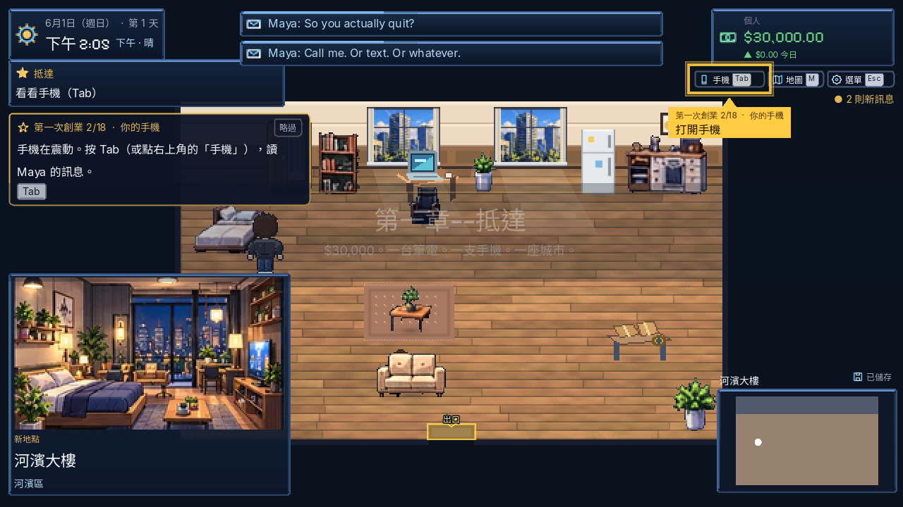 | 第 2 步：HUD 的手機按鈕被框起來 |
| 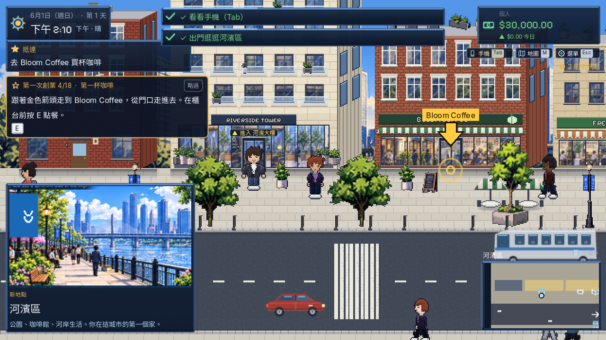 | 第 4 步：世界裡的金色箭頭和名稱標籤 |
| 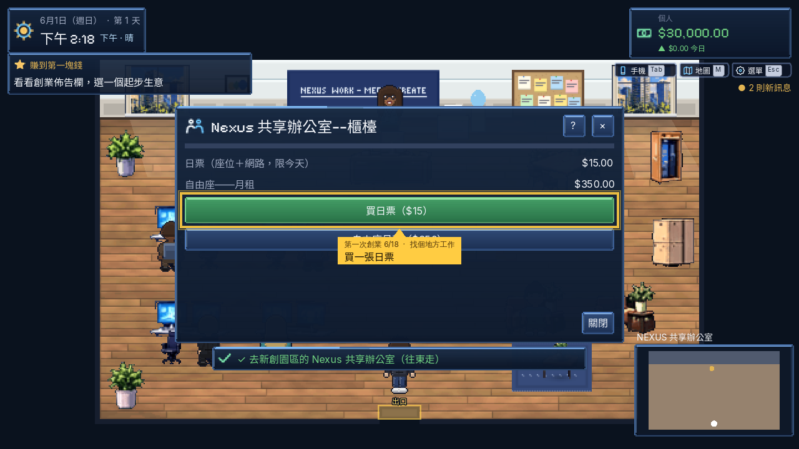 | 第 6 步：共享辦公室櫃台，框出日票按鈕 |
| 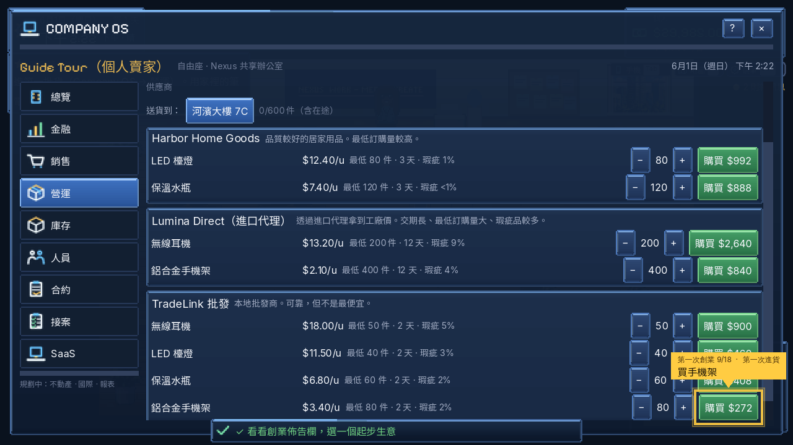 | 第 9 步：Company OS 蓋住教學卡，提示泡泡寫出步驟和「買手機架」。清單會自動捲到這顆按鈕 |
| 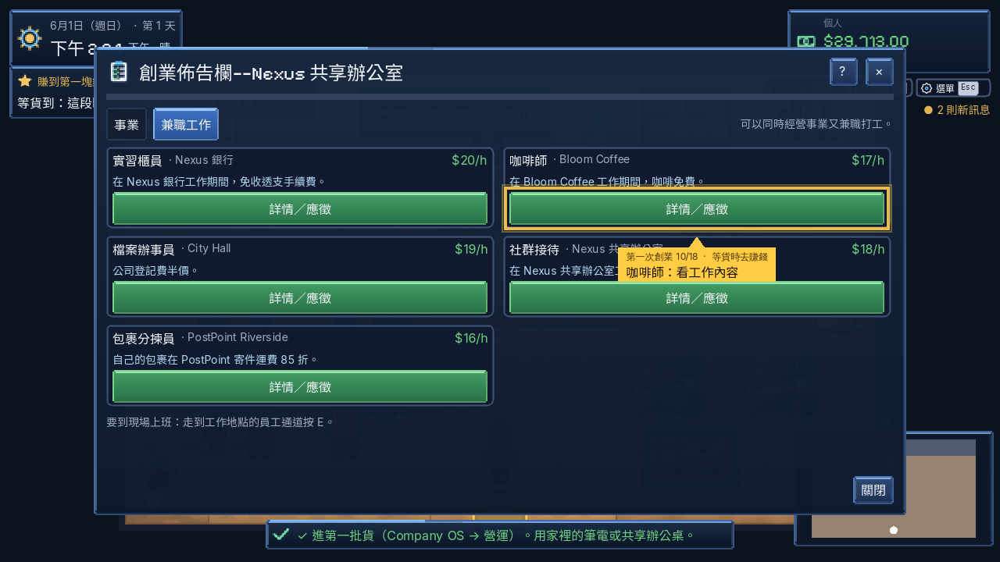 | 第 10 步：等貨時去應徵兼職 |

## 親手工作（8 個小遊戲）

小遊戲進行時，遊戲時間暫停。玩完才照工作長度推進時間，並依表現結算。中途離開不給薪水，也不花時間。

| 工作 | 畫面 |
|------|------|
| 咖啡師：照點單做飲料 | 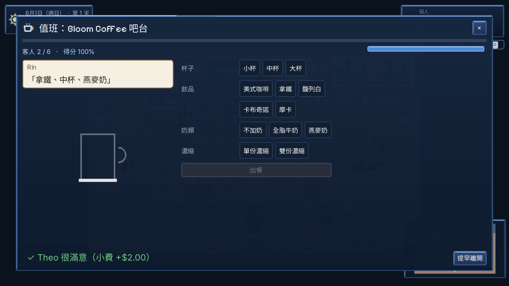 |
| 分揀員：依郵遞區號分包裹 | 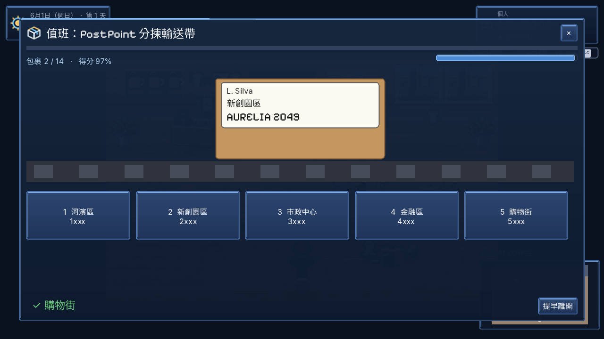 |
| 共享辦公室接待：對照預約名單 | 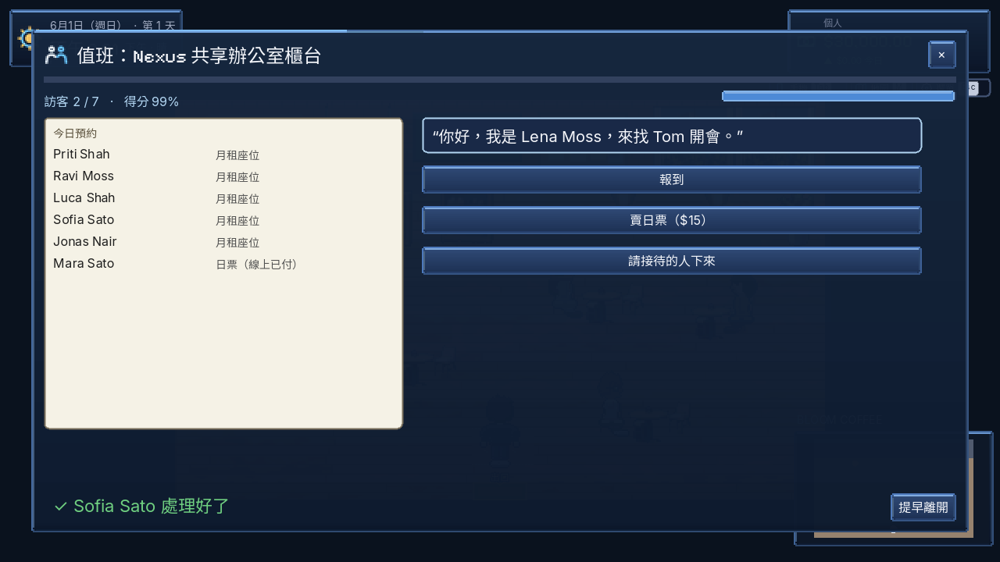 |
| 市政廳辦事員：審登記表 | 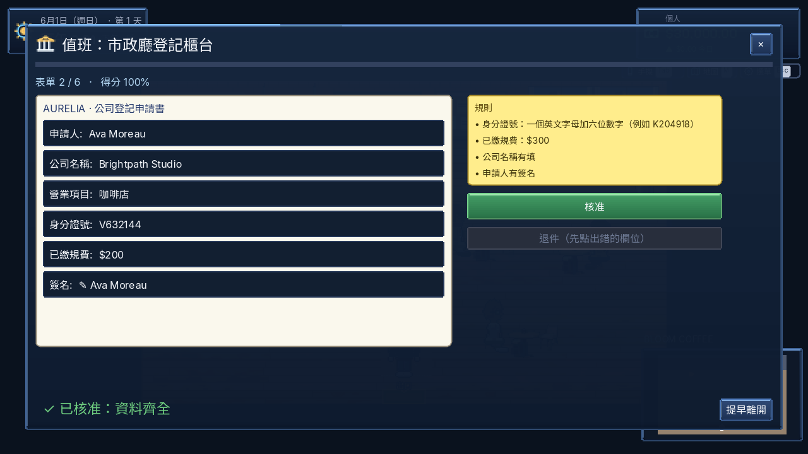 |
| 銀行櫃員：用最少張紙鈔湊金額 | 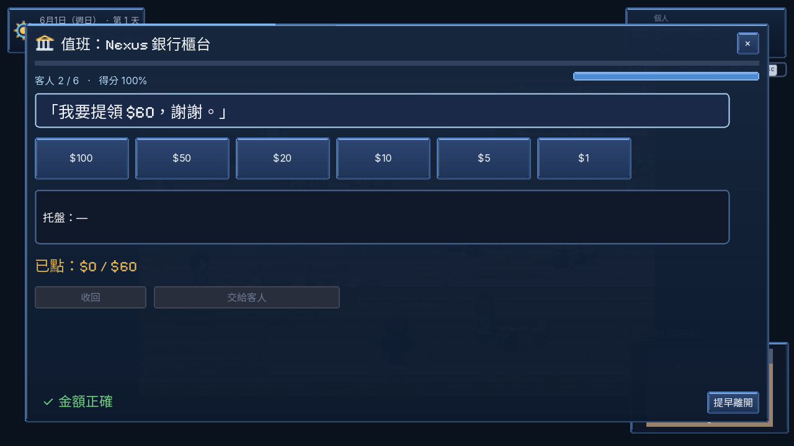 |
| 自己拍商品照：背景、燈光、構圖、對焦 | 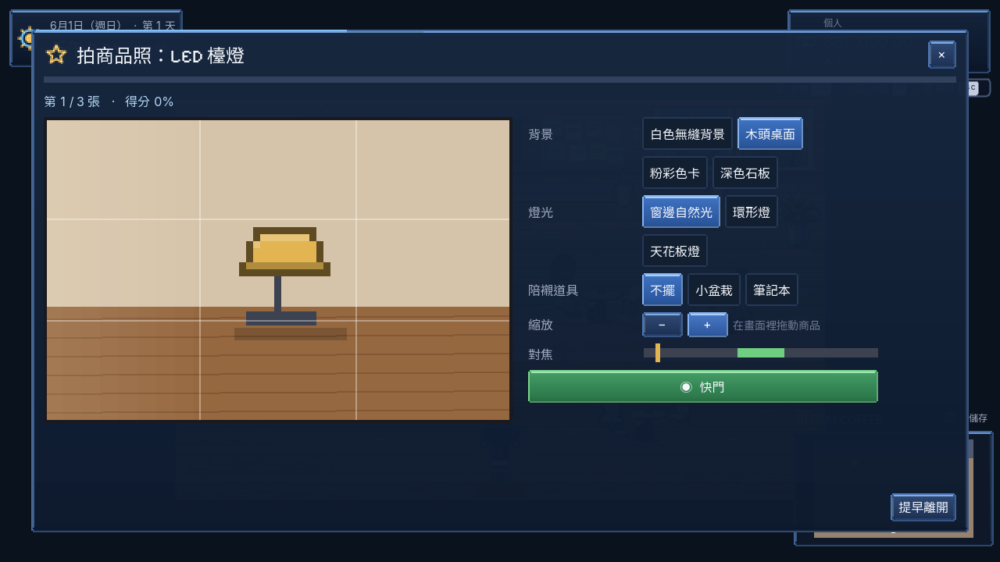 |
| 打包：箱子、緩衝、膠帶、標籤 | 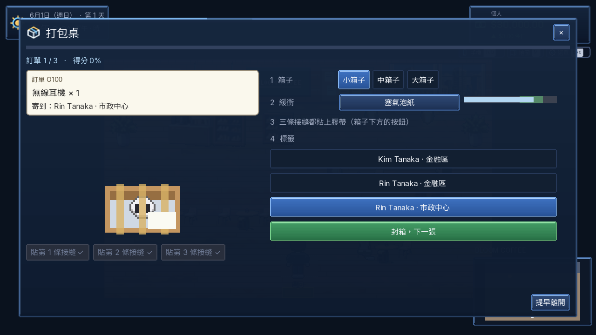 |
| SaaS／接案：照稿打出程式碼或公式 | 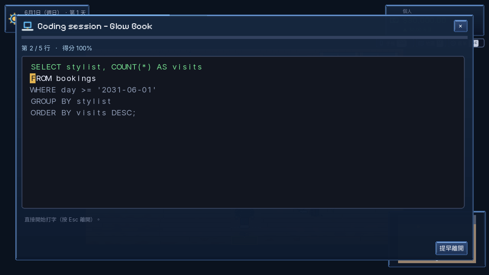 |

## 時間

- 拿掉了按住 T 快轉、「小睡 2 小時」和「快」的一天長度。
- 晚上 7 點以後才能睡覺。

## 狀態

| 項目 | 狀態 |
|------|------|
| 18 步引導、按鈕閃框、大箭頭 | Implemented |
| 8 個小遊戲，結果接到薪水、需求量、退貨、開發工時 | Implemented |
| 每個畫面的「怎麼使用」卡片（`data/help/help.json`） | Implemented |
| 不能加速時間 | Implemented |
| 起始資金 $30,000 | Implemented（原本就是） |
| 小遊戲美術 | Placeholder：用程式畫的簡單圖形。需求已寫進 `docs/wiki/90_codex_art_backlog.md`「小遊戲美術」，程式還沒讀這些檔 |

## 驗證

| 項目 | 結果 |
|------|------|
| 單元測試 | 85/85 |
| 完整遊玩第 1–6 章（`--bot=walkthrough`） | 806 步、0 失敗、0 程式錯誤、121 張截圖 |
| 小遊戲巡禮（`--bot=minigames`，英文、中文） | 各 28 張、0 失敗 |
| 引導巡禮（`--bot=tutorial`，英文、中文） | 各 13 張、0 失敗 |
| 截圖巡禮（`--bot=shots`） | 41 張、0 失敗 |
| `wiki_check` | OK |
| 翻譯 | 2097 條，缺 0 |

中文截圖檢查時順便修掉的：

- 下面這些文字原本沒翻譯：
  - Company OS 總覽的「not registered (personal seller)」和「you」；
  - 櫃員小遊戲的「✓ Exact」；
  - 其他小遊戲的回饋字（`flash()` 現在自己翻譯）。
- Company OS 總覽的兩格原本是寫死的：
  - 「員工 1」改成實際人數（你＋員工）；
  - 「階段 0 · 單人」改成「已送達訂單」累計數。
- 打字小遊戲的字距不均（「functi on」），現在每個字置中在格子裡。
- 咖啡點單在中文用「、」分隔、「」括起來。

完整遊玩測試是在上面這些修正之前跑的。這些修正只動畫面文字和提示泡泡，改完後重跑了單元測試、小遊戲巡禮、引導巡禮和截圖巡禮。
