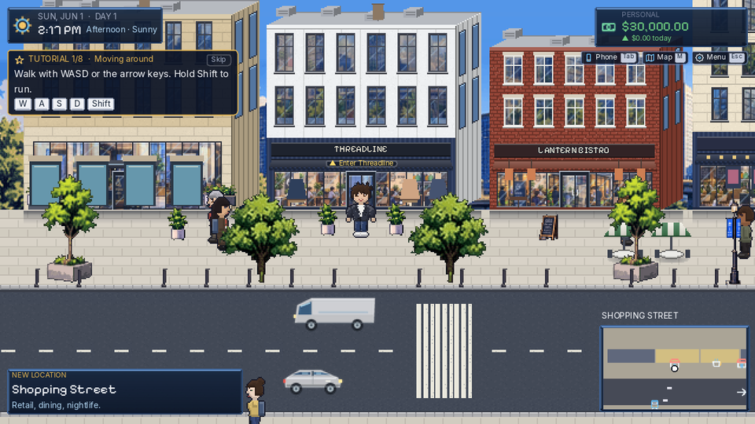
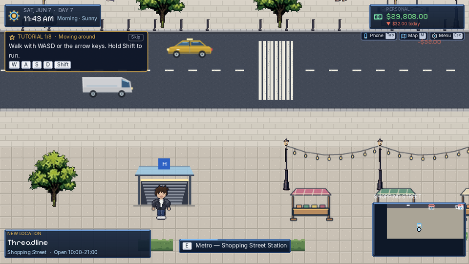
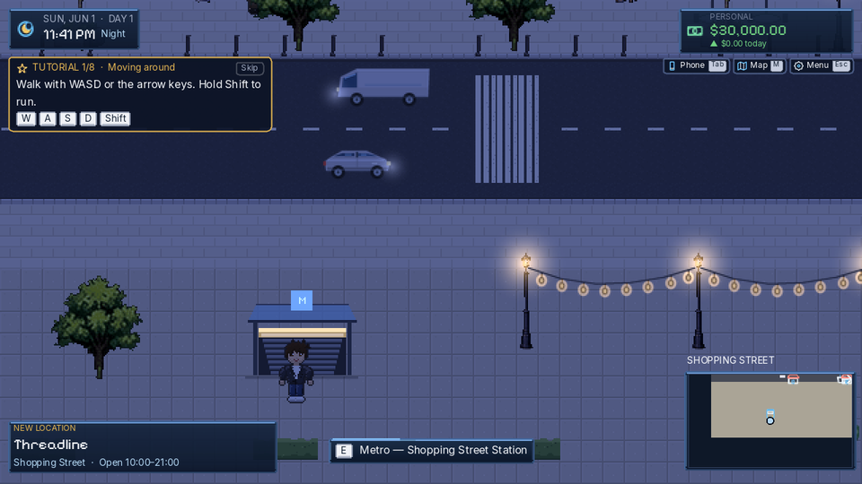
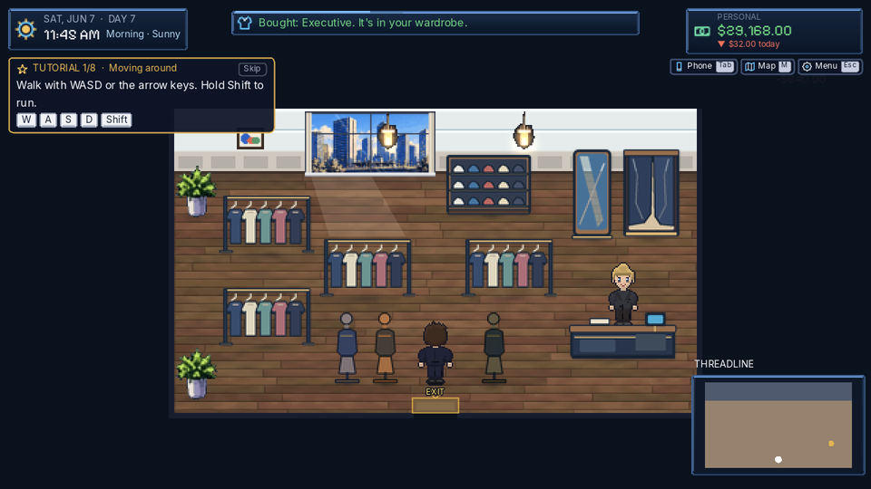
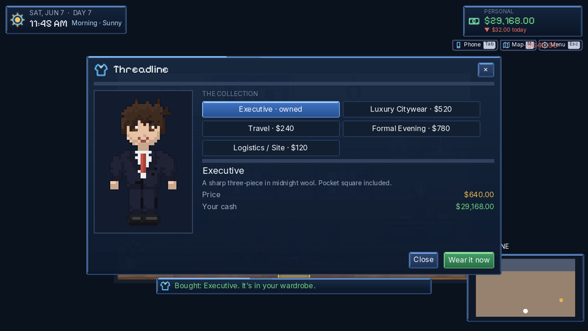
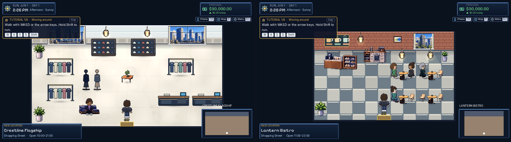

# 第四輪驗收（R7、A7、A8、B1 起步）與購物街上線

Codex 的四批（PR #11–#14）已合併到 `claude/exciting-bardeen-y71ixv`。Claude 線在同一輪把購物街接進遊戲。

## 驗收結果

| 批次 | 結論 |
|------|------|
| R7 小修正 | ✅ 招牌板加寬、無名建築改雨遮或門牌、地圖補丁（`map_label_check: OK`）、地點卡補丁、咖啡師和市政職員制服分層 |
| A7 UI 圖示 | ✅ 43 個圖示統一成圓角線條。`company`、`walk`、`civic` 三個不好認，列在 R8 |
| A8 車輛、特效 | ✅ 19 張車輛、5 個特效；`water_sparkle` 已接到河面。小車和轎車輪廓太像，列在 R8 |
| B1 起步 | ✅ 七棟立面、街道物件、Threadline 六件家具，和現有畫面一致 |

## 購物街（Claude 線）

- 從 Civic Center 往西走 8 分鐘，或搭捷運 M5。
- 市集攤只在週六、週日 09–18 點擺出來；串燈掛在路燈之間，晚上會亮。

  
  

- **Threadline**：逛衣架可以買五套服裝，在試衣間或家裡的衣櫃換上。店員 Nina 每天 10–21 點在。服裝的正式美術還沒到，先用現有服裝換色暫代，檔案一到就自動換上。

  
  

- **Lantern Bistro**：點招牌套餐 $22。**Crestline 旗艦店**：第 5 章交貨後展示台上有玩家的檯燈。**Pop-up Unit 5**：空店面，承租規劃中。兩間店的家具用現有家具暫代，資料已經寫好正式檔名，檔案到了就自動換上。

  

## 順便修的舊 bug

換場景時舊場景的牆會在物理世界多留一幀。直接進室內時，玩家會被推到門外 120 px。現在換場景時先把舊場景移出。

## 驗證

| 項目 | 結果 |
|------|------|
| `pose_check` | OK |
| `map_label_check` | OK |
| 單元測試 | 74/74 |
| 截圖巡禮 | 41 張，0 失敗 |
| 完整遊玩第 1–6 章 | 813 步、0 失敗、0 程式錯誤 |
| `wiki_check` | OK |
| 翻譯 | 缺 0 |

給 Codex 的下一批需求（R8、B1 續）在 `docs/wiki/90_codex_art_backlog.md`。
