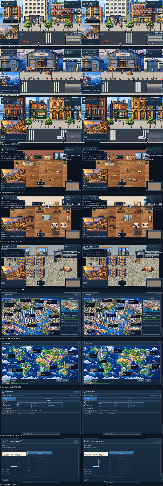

# #166 download headroom

Base: `b00bb9b75a5d651040b93b68442040edb3ee1f99` (#162/#163 merged).
Engine: Godot 4.5.1 official Windows console, Compatibility/OpenGL3, 1280×720, zh_TW.
Capture: `--bot=asset_size --out=<this directory>/before|after`; seed 166, default preferences,
high-detail enabled, isolated `SaveSystem.DIR` and preferences inside the bot output.

| Decimal MB | Before | After | Saved | Target / hard limit |
|---|---:|---:|---:|---:|
| Windows ZIP | 178.014058 | 146.789930 | 31.224128 | 165 / 180 |
| Web PCK | 157.060356 | 126.142916 | 30.917440 | 145 / 160 |

Before: standalone untouched-asset exports, ZIP reconstructed with exactly the release script's
entries/README/ZipInfo/compression settings (see `baseline_sizes.json`). After: `bash tools/package_release.sh`.
Local baseline binaries remain outside git. No release/upload/merge was performed.

`asset_size_before.txt/json` and `asset_size_after.txt/json` list actual PCK entry sizes, folder/extension totals,
top 50, conservative reference candidates, native/detail pairs, identical source hashes and uncompressed audio.
Reference candidates are **NOT PROVEN UNUSED**: dynamic string construction requires manual review.
No resources were deleted. Native/detail pairs remain because `Art.tex()` reads native dimensions and offers
the low-detail setting. Audio already uses Ogg Vorbis; ambient players load Ogg streams, so no audio transcode
or playback change was necessary. Character and UI textures retain lossless imports.

86 import settings use lossy quality 0.92: 4× building facades, floor textures, route-map illustration.
Native PNGs, full-resolution PNGs, dimensions, alpha, palette, UI, gameplay, save format and economy remain intact.
The manifest records every changed import. No `company_os.gd`, industry copy or `mini_game.gd` edits.

## Rendered comparisons

Individual full-size JPGs are under `before/screenshots/` and `after/screenshots/`.
Samples: Riverside, Harbor, Old Town, Bloom Coffee, Nexus cowork, Pier 7 warehouse, city map, world map,
Company OS and barista practice. Reviewed all ten pairs and the full-size Riverside facade pair:
no obvious blur, lost sign detail or changed layout. Small differences in vehicles/portraits are live animation.
Original PNGs are retained locally under `qa-output/166-comparison-originals/`.

## Validation

- Class cache: `godot --headless --path game --editor --quit`, before and after imports.
- Package: all four platform packages produced; both targets PASS (`package.log`).
- Final full unit suite: see `units-final.log`.
- i18n: 8,228/8,228 zh_TW translations, missing 0; wiki: 3,913 assets / 343 IDs OK; beta audit: 0 hits.
- Build-size boundary tests: 5/5; target +1 byte warns, hard limit +1 byte fails, missing/ambiguous files fail.
- Post-package rendered map and industries: results recorded alongside this README when complete.
- Unit negative-input cases print codec errors; teardown also reports inherited RID/ObjectDB leaks.
  These are recorded, not represented as a browser-console-zero claim.
- Capture bot: before and after 0 failures; English audit's two hits are the QA company name `Comparison Co`.

## F1–F8 / player review

F1–F7 N/A to import compression; their gameplay, tutorial, accounting and save flows are guarded by the
unchanged unit suite and rendered industry/map tours. F8 PASS for the sampled rendered appearance:
no extra emphasis, changed typography or hit targets introduced.
Novice perspective: the streets, first work practice and next-action buttons retain their existing appearance;
this is a fixed-state visual review, not a new blind novice playtest.
Experienced replay: high-detail facades and familiar Company OS geometry remain intact; the normal low-detail
choice still exists. Physical devices, Safari and subjective reviewer acceptance are not established by #166.
