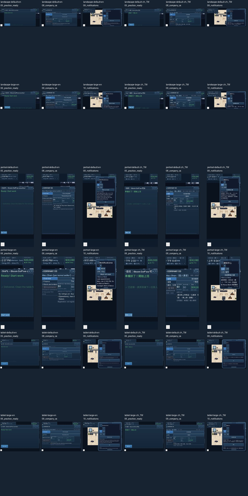
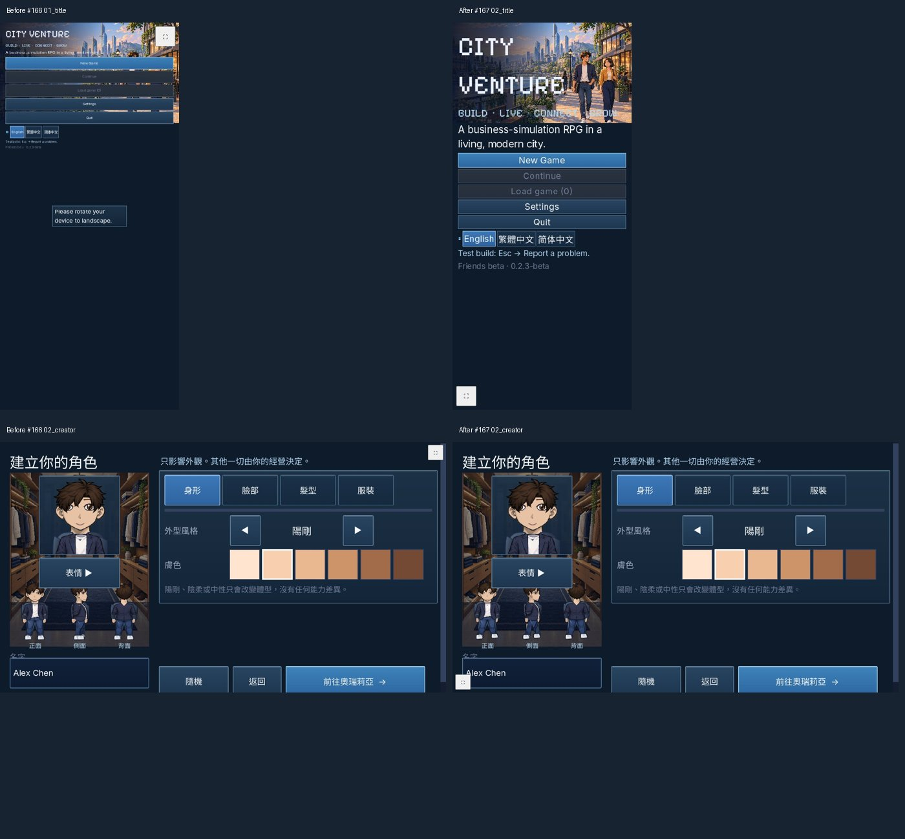

# #167 Web touch validation

Stacked on #166 / PR #168. Godot 4.5.1; Playwright 1.61.0; Chromium
149.0.7827.55; fresh browser storage for every case; is_mobile/has_touch enabled.
The opt-in `?cv_smoke=1` probe observes controls and state only. Actions are
real touch taps/drags; the driver never invokes game methods or edits saves.

## Full exported-Web matrix

[Successful CI run](https://github.com/btcson66-rgb/City-Venture/actions/runs/37762985043)
at `3123b16e671dcd672315146bd77c3e407fc5b1bc`: all six jobs, both locales,
12/12 complete flows, 150 individual JPGs, console/page errors **0**.
`matrix-ci.json` and each `after/*/result.json` record the actual exported PCK
SHA256 `923090e059cf050913c0c2804f0a2fe7b4722bd8ec89239c4013ace056b3ee6b`.
CI creates one actual `build/web`, verifies its checksums, and shares that exact
export between the six jobs. A failed flow or console error makes the job fail.

| Viewport | Normal zh_TW / en | Extra-large zh_TW / en | Console errors |
|---|---|---|---:|
| Portrait 390x844 | PASS / PASS | PASS / PASS | 0 |
| Landscape 844x390 | PASS / PASS | PASS / PASS | 0 |
| Tablet 1024x768 | PASS / PASS | PASS / PASS | 0 |

Every flow captures title, character creation, arrival, guided first-job practice,
practice completion, six actual formal orders, results and payout, Company OS,
real bank appointment notification, notification Go, save and reload/Continue.
Large cases also capture the selected Extra large setting (font_size=3).
Practice leaves money/shifts unchanged; paid work increments shifts and cash.
Reload preserves name, cash, shifts, slot and font preference; Ledger is balanced.
Doors, sleep, metro and bank opening follow normal movement and simulation time.



Full-size per-step JPGs are in `after/`. `desktop/` adds 16 rendered 1280x720
touch captures (zh_TW/en, normal/extra-large, title/creator/arrival/phone apps).
Reviewed the contact sheet and full-size large portrait Company OS/notifications,
creator and phone-app screens. Company OS retains horizontal scrolling for wide
content rather than changing its tab structure or industry descriptions.

## Fixes and scope

- Detect touch before the first tap; maintain at least 44 logical-pixel controls
  (about 26.8 CSS px on the narrow phone, above the 24 px requirement).
- Compensate physical font scaling on touch exports; enlarge scrollable touch
  modals in both orientations, including the formerly clipped Sleep action.
- Increase phone content area, wrap notification text, reduce app columns with
  large text, preserve existing icons and wording.
- Ignore decorative interior panels for ground taps; use the existing physical
  movement/collision path to enter a touched doorway.
- Cancel a pending button press when scrolling, including multi-finger gestures;
  leave retiring Web UI in the tree until frame end to avoid releasing-touch errors.
- Defer language-menu replacement; avoid empty audio tweens before first gesture;
  move the HTML fullscreen touch target away from the HUD.
- The QA driver approaches via exposed ground, avoids HUD panels and confirms a
  modal actually closes before walking. These checks do not alter game state.

No Company OS source/content, industry text, mini_game.gd, gameplay rules,
economy values or save format changed. Shared Modal sizing affects Company OS
geometry only. No resources were deleted. Latest Claude test-fixture initialization
is retained; it prevents the packing layout fixture from silently entering tutorial
mode before its assertions. It does not change PackGame or its player tutorial.

## Reproduction and before evidence

```
godot --headless --path game --editor --quit
bash tools/package_release.sh
python tools/qa/web_smoke.py --export-dir build/web --out qa-output/web-smoke
```

`before/` renders #166 UI (`c66bb702`) at matching desktop/portrait dimensions,
locales and font choices. Only the read-only measurement probe and its boot hook
are added in a separate temporary project; game/UI/input code is untouched.
Before console errors/failures are diagnostics, not passing acceptance results.
All eight baseline captures complete (24 JPGs): desktop/portrait, both locales,
normal/Extra large, title/creator/arrival. The original empty audio tween and
releasing-touch tree errors remain recorded. Missing-resource/white renders from
an incomplete temporary setup were discarded and re-captured with all shaders.

Reproduce the measurement project with `python evidence/2026-10-08_167/prepare_before.py`,
import/export `qa-output/167-baseline-probed/game` into its `web/` directory, then
`python evidence/2026-10-08_167/capture_before.py`.
The original baseline PCK remains locally in `baseline-web` for size comparison.
Browser contexts and native bot output directories isolate QA from player saves.

## Validation and limits

Integrated package/import/audit results and exact local package hashes are in
`package-integrated.log`, `import-integrated.log`, `*-integrated.log` and
`package_sizes.json`. Final integrated package suite: **987/987 (586.0s)**,
all four platform packages produced, exit 0. Windows ZIP **146,797,815 bytes**
(146.797815 MB; target 165 MB), local Web PCK **126,151,976 bytes**
(126.151976 MB; target 145 MB). The local PCK SHA256 is
`feb3e57670022f6f1e903ceb0a5f587fe062a9338b0974f7b4cc45a320e592f7`.
The post-package local portrait/extra-large/English repeat also completes all
13 steps: **PASS, 139 touches, console errors 0**, including real payout and
reload (`local-package/result.json`, per-step JPGs, `packaged-integrated-smoke.log`).
The Linux CI export and Windows-built package are separate actual exports; their
hashes are recorded separately, never presented as identical binaries. Runtime
game/UI/source is unchanged from successful CI 3123b16e; integration adds source
translation references, documentation/CI settings and test-fixture cleanup.
Earlier complete full suite: 987/987 (628.0s), package suite:
987/987 (694.1s); focused touch regression 5/5 and packing layout 1/1.
The full suite includes old-save migration/plain/gzip readback tests; the browser
flow separately checks real IndexedDB save persistence. i18n: 8,228 zh_TW msgids,
missing 0; wiki: 3,913 assets / 343 IDs; beta audit: 0 hits.

Headless negative codec tests deliberately print decompression errors; teardown
reports inherited RID/ObjectDB leaks. The inherited mini_game.gd:604
ensure_control_visible ancestor error is recorded and remains outside Session F's
protected source. No SCRIPT ERROR/Parse Error is accepted as a green suite.
These headless diagnostics are separate from the measured Web console 0 errors.
An earlier GitHub billing-start failure is retained as historical evidence only;
the successful run above supersedes that blocker.

WebKit is not installed locally or in the Chromium CI job; Safari is NOT VERIFIED.
These are browser-emulated touch viewports, not physical phones/tablets or a
public itch.io test. A blind human novice and a ten-hour human replay are also
NOT VERIFIED. No merge, commercial release or public deployment was performed.

## F1-F8 / player perspectives

| Principle | Result within this ticket |
|---|---|
| F1 | PASS sampled practice: highlighted targets, safe guided sequence, transition to formal work. Replay/skip remains covered by existing tests. |
| F2 | PASS sampled normal work: no required countdown; ordinary work yields actual pay. |
| F3 | PARTIAL: original phone/Company OS availability is retained; whole-game disclosure is outside scope. |
| F4 | PARTIAL: next practice/formal action is reachable; original wide Company OS remains scrollable. |
| F5 | N/A: no assistant/economic automation changes. |
| F6 | PARTIAL: notifications wrap and are readable; existing Company OS/industry prose is intentionally retained. |
| F7 | PASS sampled flow: scrolling does not select an unintended recipe; real save/reload retains balanced state; old-save tests pass. |
| F8 | PASS sampled screens: existing quiet palette retained; no additional attention colors or decorative emphasis. |

Novice perspective (automated observation): create a character, touch the current
practice target, complete the safe lesson, start formal work, see the real payout.
Scrolling and small text were the main friction; the revised controls remain reachable.
This is reproducible automation, not a claim that a blind human understood the game.
Experienced replay: Continue restores the paid-shift save and its font choice without
replaying creation/practice. This is a saved-state replay, not ten hours of human play.
